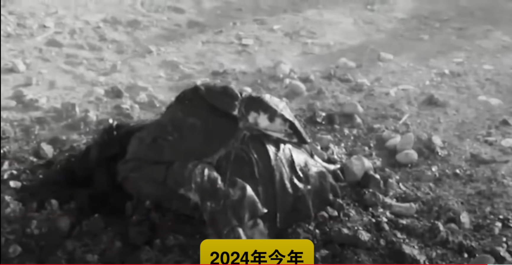

---

title: 基督教、以色列犹太教、中东穆斯林教的石刑

description: 很多人以为石刑是穆斯林独有的，其实这个刑法是犹太教、基督教和穆斯林教共有的，只不过近些年只有穆斯林的清真教有在执行

#多个标签请使用英文逗号分隔或使用数组语法

tags: 杂谈

#多个分类请使用英文逗号分隔或使用数组语法，暂不支持多级分类

---

# 很多人以为石刑是穆斯林独有的，其实这个刑法是犹太教、基督教和穆斯林教共有的，只不过近些年只有穆斯林的清真教有在执行

石刑：被石刑处死的女人

 

 

被石刑处死的公主：

 

 

对公主执行石刑的家人们：

 

 

公主被执行石刑处死的过程被记录了下来：

 

 

在其之后依然有女人被执行石刑处死：

 

 

被至亲亲人用石头活活砸死其过程异常惊悚，过程十分残酷及反人类，该种处死的方式近些年在印度也屡屡出现：

 

 

要知道首创石刑的是以色列的犹太人，他们将该种刑法记录到教法之中，并且该种刑法也被欧洲的西方国家的基督教所采用：

 
 

过于残忍的画面：

