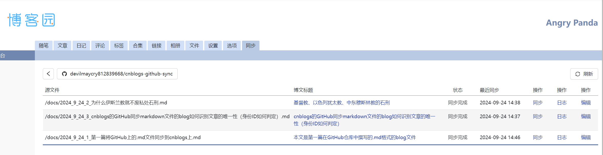
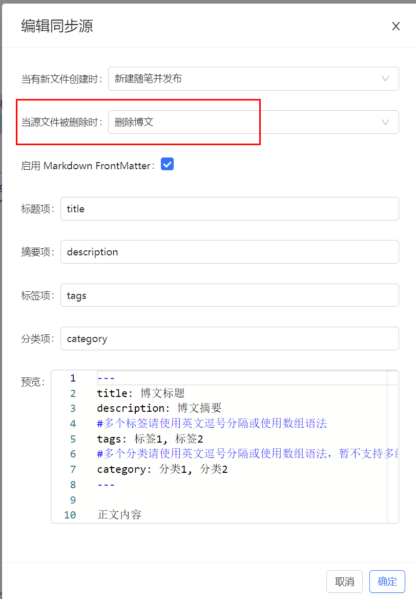

---

title: cnblogs的GitHub同步markdown文件的blog如何识别文章的唯一性（身份ID如何判定）

description: 

#多个标签请使用英文逗号分隔或使用数组语法

tags: 杂谈

#多个分类请使用英文逗号分隔或使用数组语法，暂不支持多级分类

---

 
 

 

 

本篇blog是写在GitHub的对应的仓库中的。

 

cnblogs会给终身用户提供一个把GitHub仓库中的markdown文件同步到cnblogs上的一个服务，本文就是使用这个服务同步到个人blog地址的：

https://cnblogs.com/xyz

 
 

问题1：何时触发blogs的同步？

当仓库中的markdown文件有更新时，cnblogs会自动同步到个人blog地址，但是，如果markdown文件没有更新，cnblogs不会同步。这时候的更新就是在对仓库内容进行推送的时候发生的，在推送动作发生时github会触发cnblogs的同步动作，将docs文件夹下新创建的文件(.md)同步到cnblogs中，并将docs文件夹下删除的文件(.md)进行对应的操作；其中，对新增文件和删除文件的判断是根据git push时的commit信息来判断的，即commit信息中包含新增或删除的文件名。

 

 

问题2：如何判断文章的唯一性？

虽然git commit的提交信息中有新增和删除的文件信息，但是，在cnblogs中，文章的唯一标识是文章的标题，即在文章的标题栏中输入的标题。

删除文件自然没有什么识别问题，只要对相应的文件执行对应操作即可；但是，对新增文件则需要进行一定的判断，因为git commit中的新增文件有可能是改名后的，也就是说文件被改名了，那么在git commit信息中记录的是两条操作，第一条是删除操作，第二条是新建操作。删除操作没有什么疑问的，但是这时候的新建操作就会出现问题。由于在cnblogs中，文章的唯一标识是文章的标题，即在文章的标题栏中输入的标题，那么在markdown文件改名时如果没有修改文件中的blog title的话，并且删除文件操作对应的并不是删除blogs的话（无操作或取消发布），那么cnblogs会认为该文件已存在而不执行新建操作。

如果对改名后的文件进行内容修改（不更改题目title），那么cnblogs也会认为该文件已存在，但是不会执行修改操作，而是把这一次git commit的原文件当作一个重复命名的新文件，然后把这个新文件以草稿的形式进行保存。

从而可以看出使用GitHub同步blogs的这种方式对于修改markdown文件名的支持是很不好的，如果你真的对markdown文件名进行修改，那么建议你先手动删除掉cnblogs中对应的文章，然后再对GitHub中的markdown文件进行修改，最后再对GitHub进行同步，这样cnblogs中才会将将你修改文件名后的文件以正确的blog形式进行发布。

 

为了更好的解决重命名markdown文件并且还没有修改对应的markdown文件中的title的话，那么我们最好是在进行同步设置时指定markdown文件删除动作对应删除blog的操作（误操作和取消发布都无法保证一致性），这样就可以保证一致性了。

 

从上面的分析可以看出，重命名后的markdown文件会导致cnblogs无法从GitHub上正确同步，这样的情况也会在你发表的blog被判定为不可见的情况。如果你在GitHub中的markdown文件同步到blogs上后被cnblogs判断为违规而可见权限变为不可见，那么在不修改GitHub中对应markdown文件名的情况下（也就是说不删除这个对应的markdown文件的情况下），那么所有对GitHub中的对应的该blog的markdown文件的所有更改均无法同步到cnblogs上的对应blog。换句话说，如果你的markdown文件对应的blog被判为违规，那么在此之后的所有对markdown文件的修改都不会被同步到cnblogs上。

 
 

 
 