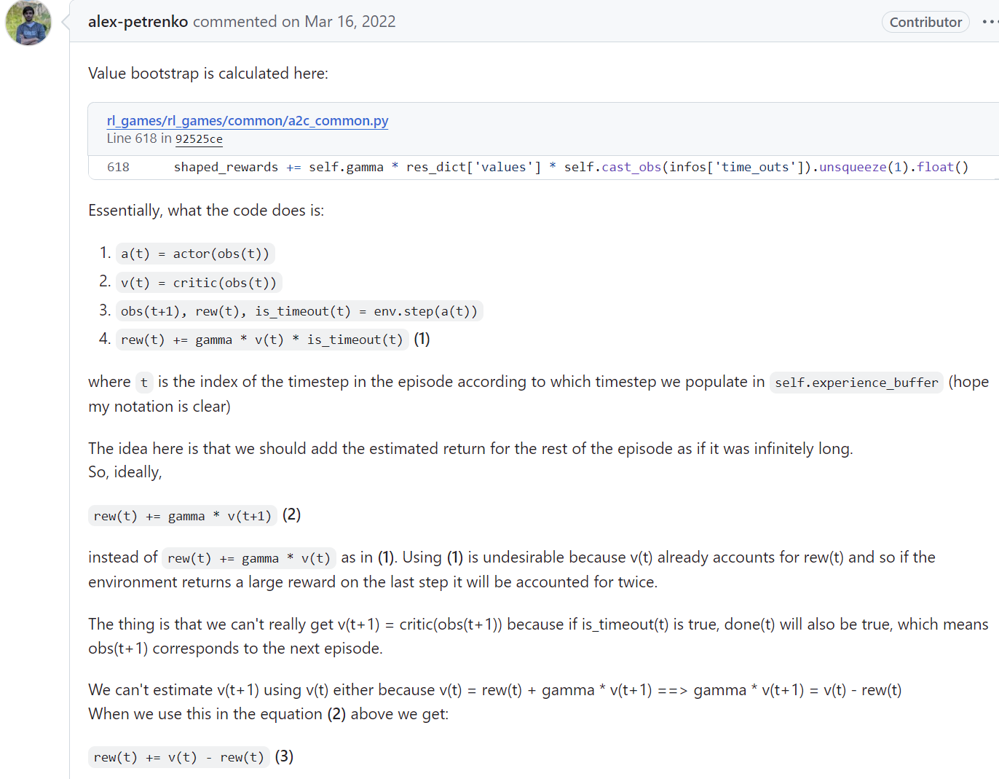
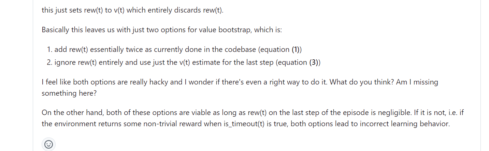

---

title: 强化学习：如何计算被环境系统截断的terminated state的value值 —— (Bootstrap returns from value estimates if episode is terminated by timeout)

description: 

#多个标签请使用英文逗号分隔或使用数组语法

tags: 杂谈

#多个分类请使用英文逗号分隔或使用数组语法，暂不支持多级分类

---

本文主题：如何计算强化学习中被环境系统截断的terminated state的value值

首先解释一下什么是强化学习中的terminated state的value值，强化学习就是一个智能体（agent）不断和环境交互的过程，而这个交互的过程分为无限步数和有限步数，即使面对有限步数的情况下往往由于步数过长我们也是将其视作无限步数的情况来对待处理的，也正是因此我们才需要对agent与环境的交互过程进行截断，于是便有了截断的terminated state的value值。

被截断的状态，即episode的最后一个状态的state的value值就是截断的terminated state的value值。

对待该问题的讨论分为两个情况，一种是非并行采样的情况，即agent与环境的交互是非并行的，另一种则是并行采样的情况。

 

**串行采样（交互）/非并行情况：**

环境系统返回给agent的截断terminated state是真实的 terminated state，此时我们可以根据state value的状态值估计函数获得估计值，比如在actor-critic算法总critic部分的拟合函数给出的值；但是在很多论文中在这种串行的环境下很多时候是不对terminated state是否被环境系统截断作区分的，如果这个terminated state是episode的自然结束的state，那么对应的state value为0，如果$s_{t+1}$是episode自然结束的state，那么$v(s_{t+1})=0$，那么对应$v(s_t)$的计算则为$v(s_t)=v(s_t)+[\alpha*(r+v(s_{t+1})-v(s_t)]$，即$v(s_t)=v(s_t)+[\alpha*(r-v(s_t)]$，而如果对截断作区分的话那么截断的terminated state的$V$值就需要拟合函数的计算获得，即$v(s_{t+1})\neq0$，从而有$v(s_t)=v(s_t)+[\alpha*(r+v(s_{t+1})-v(s_t)]$。

 

个人在处理这个问题的时候习惯于不对截断的terminated state作区分，也就是默认认为terminated state的$V$值为0，并且该种处理方法在多种论文和代码实现上均被采用，当然这样做就会导致一个问题，那就是不对截断的terminated state区分必然导致在强化学习算法计算过程中人为因素的引入多余偏差，而至于这种偏差是否会导致算法性能变差也并没有系统的研究论文。

 

不过必须要说的是，虽然做串行采样的论文是不对截断状态作区分的，但是有一小群的人却坚持对截断的terminated state作区分，并坚持使用这种减少方差的方法。

说下个人观点：

对不对这个截断的terminated state作区分主要看这个不作区分的话对算法性能是否有影响，如果这个episode的长度比较长，比如一个episode的长度是50,100，更或者是200，并且被截断的状态数量所占比例不是很高，那么不对截断的terminated state作区分也不会对算法性能有太多影响；但是如果episode长度比较短，比如步数在5步内，10步内这种，并且大比例的episode的最终状态是被截断的，并且截断的状态很有可能在其他的episode中以非终点状态的形式出现，那么不对截断的terminated state作区分就会明显影响强化学习算法性能。不过以我个人的经验来说，极少会遇到episode长度短，并且episode的最终状态大比例的是截断的terminated state，因此在我个人的应用环境背景下来说不对截断的terminated state作区分是完全可以接受和允许的。

 

 

**并行采样（交互）/并行情况：**

该种情况下与串行的情况最大的不同在于各大强化学习算法框架和加速库为了追求更高的计算效率和编码的模块性，于是把episode的初始化放在了并行环境的自动处理的环节中，也就是说该种情况下强化学习计算框架默认不返回信息显示状态是否为episode的最终结尾状态还是**截断的terminated state**，并且在不区分episode的最终状态和截断的terminated state的同时在返回状态信息时会自动返回下一个episode初始化时的状态；并且即使有的算法框架在自动对环境进行重新初始化并返回新episode的初始state的同时会返回上一个episode是否是被截断的信息，比如在返回的info信息中带有**is_timeout**的信息，如果这个字段为true，那么意味着上个episode的结束是被环境截断的，如果在**done=true**的同时**is_timeout=false**那么则意味着上个episode是自然终止的而不是因为超时而被环境截断的。

在强化学习的经典环节cart-pole的小车平衡杆问题中默认的limited time=200，也就是说如果一个episode的步数/长度小于200，那么这个episode必然是自然终止的，但是如果episode长度为200，那么大概率是被环境截断的，至于是不是一定是被环境截断的就需要看info信息中是否有**is_timeout**的信息。

本文讨论的并行采样的情况下是基于上述的并行强化学习算法的背景的，也就是说不论上一个episode是自然结束还是被环境截断的，返回的next state均为下一个episode的初始状态。

  

关于并行采样情况下如何处理截断状态的$V$值，本文根据下面资料进行展开：

Bootstrap returns from value estimates if episode is terminated by timeout. More info here: https://github.com/Denys88/rl_games/issues/128

 

注意，以下内容讨论的都是并行采样情况下区分截断的terminated state，如果不区分的话那么和串行采样时一样可以将最终state的$V$值设置为0，并且要说明一点，那就是在并行采样的强化学习环境中大多数的环境都不太会进行环境截断的，比如mujoco环境，大多数情况下和串行采样时一样都不对截断环境作区分的，因为像mujoco这样的高难度仿真环境里面episode的结束往往都是因为自然结束而不是被环境截断，毕竟环境难道大，算法难以大比例的进入到需要环境截断的情况。

对于一些特定的环境问题，被环境截断是有一定比例，因此这种情况下就需要对截断状态作区分的。

 

地址：

https://github.com/Denys88/rl_games/issues/128

 

这里主要是讨论上面这个GitHub上的一个讨论帖子，这个帖子就并行采样时如何处理在区分terminated state时处理$is\_timeout=true$时的episode最后状态的$V$值。之前已经交代过，在并行采样的过程中默认的在episode结束时环境系统自动进行初始化，此时返回的$next\_state$其实是下一个episode的初始state。尤其在强化学习算法训练学习时需要进行bootstrap returns from value estimates，而这时是需要获得episode结束时的最后一个状态，也就是说在episode的$done=true$时，不论episode是否被截断其最后一个状态都需要返回的，但是由于在并行采样时为了提高并行采样的效率都是默认在episode结束时自动初始化并返回新episode的初始state的，因此无法满足bootstrap计算时的要求的。

为了解决在并行采样时大多数强化学习算法设计时为提高计算效率而不返回episode最后state的问题所导致无法正确使用bootstrap方法计算value return的问题，上面帖子中给出了<https://github.com/Denys88/rl_games/blob/92525ce54da0c8a6f60c9d3f88e21ef47e5b24e7/rl_games/common/a2c_common.py#L618>中的一个解决方法，那就是使用episode最后状态的前一个状态进行计算，也就是上面帖子中不使用$V(s_{t+1})$而是使用$V(s_t)$进行计算，该种方法在episode最后一步返回的reward较小时不会带来明显的计算偏差，但是如果在episode的最后一步的reward值较大的情况下，那么就必然导致$V(s_{t+1})$和$V(s_t)$之间有较大差距，这样情况下使用$V(s_t)$近似替代$V(s_{t+1})$进行bootstrap return计算就会带来较大的计算偏差；同时帖子中也分析了在不改变并行采样时自动初始化下个episode并返回新episode初始状态来替代之前episode结束时的状态的这种方法是无法避免这种计算偏差的，即使episode最后一步的reward比较平滑也无法真正避免这种偏差，因此真正的避免该偏差的方法就是对episode最后一个状态进行返回和出来，如下面中的做法：

https://github.com/DLR-RM/stable-baselines3/pull/658/files#diff-384b5f21f2bed58d1d6e64da04a42fee52f353fcec38bf410338524336657bd8R194-R205

由于根据bootstrap value的计算方法可以知道：

$v(s_{t})=r_{last\_step}+\gamma*v(s_{t+1})$

因此episode最后一步reward平滑是指

$v(s_{t}) \approx r_{last\_step}+\gamma*v(s_t)$

那么也就是说最后一步reward平滑时

$r_{last\_step} \approx  (1 - \gamma)*v(s_{t}) $

因此必有：

$v(s_{t}) \approx r_{last\_step}/(1 - \gamma)$

又由于：

$v(s_{t}) = r_{last\_step}+\gamma*r_{last\_step+1}+{\gamma}^2*r_{last\_step+1}+{\gamma}^3*r_{last\_step+2}+......$ 

可以得到：

$r_{last\_step} \approx \frac{(1 - \gamma)}{\gamma} * (\gamma*r_{last\_step+1}+{\gamma}^2*r_{last\_step+1}+{\gamma}^3*r_{last\_step+2}+......)$

而上面的这个表达就是在进行bootstrap value计算时使用后一个state替代前一个state时低偏差所要求的reward的平滑形式。

 

在实际的应用问题中，能完美符合上面的这种平滑形式的还是比较少的，但是一般待解决的问题的episode长度较长，从而导致根据episode最后一个state的$V$值进行bootstrap value计算的比例在总的计算样本中的比例占比较少，因此在多数问题中episode的最后一个state的$V$估计值即使有偏差也并不会造成算法计算过程中的明显偏差，因此在很多的并行强化学习算法采样时是不对该问题进行处理的。

 
 