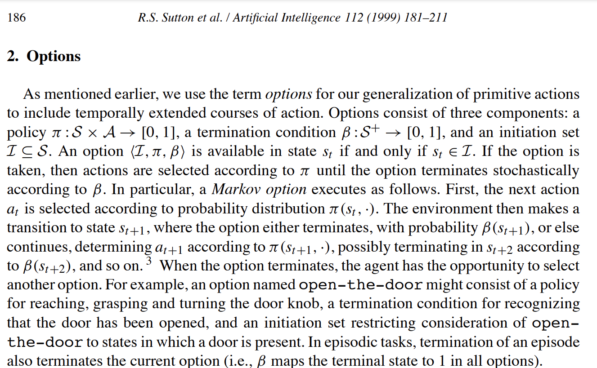
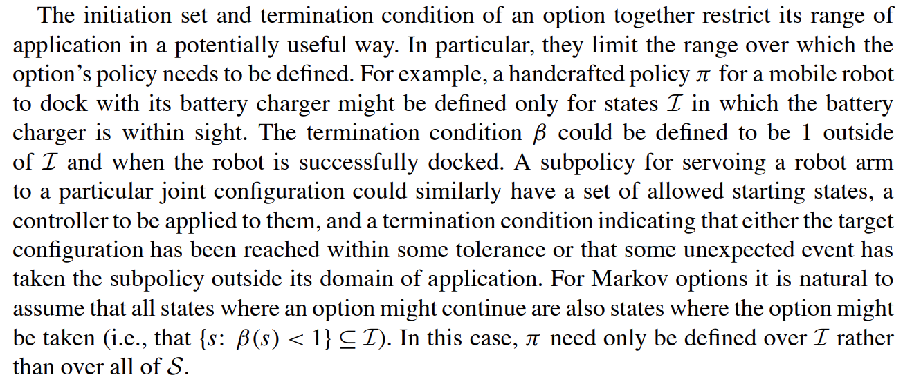
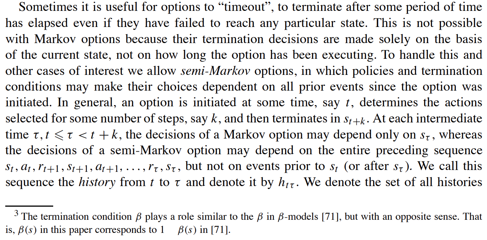
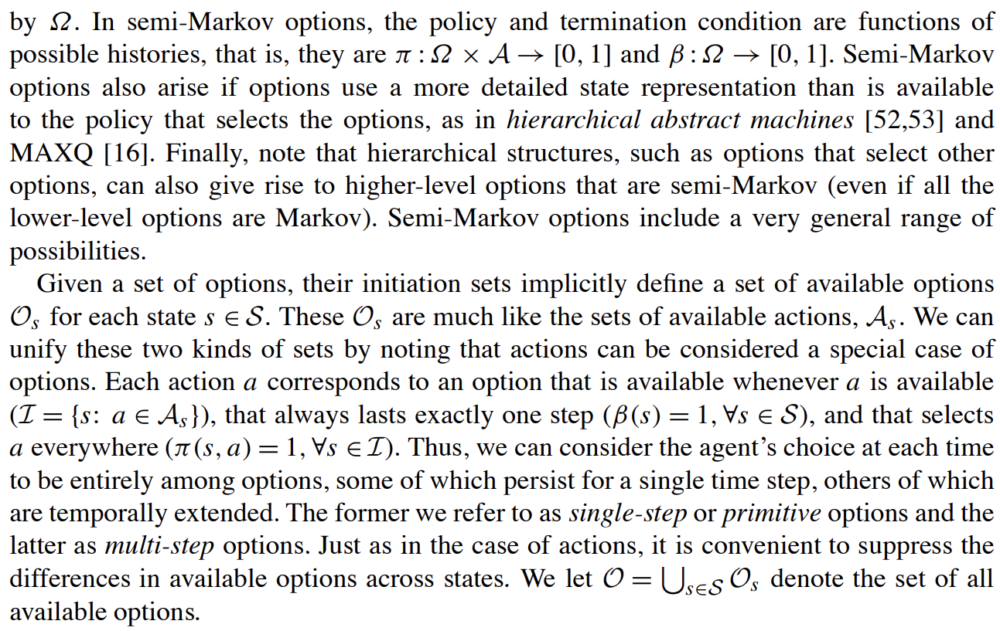
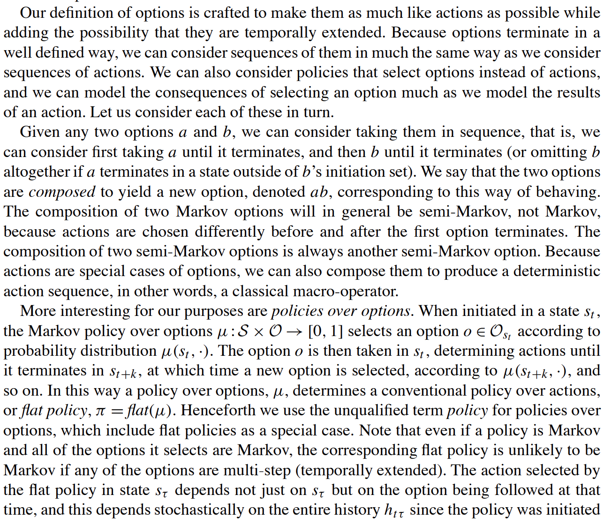
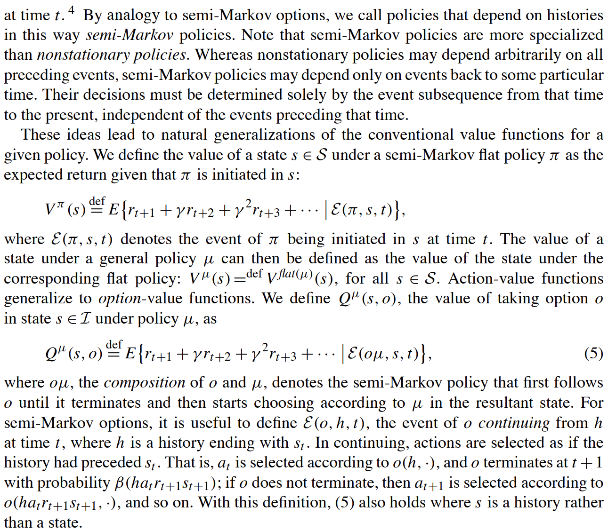
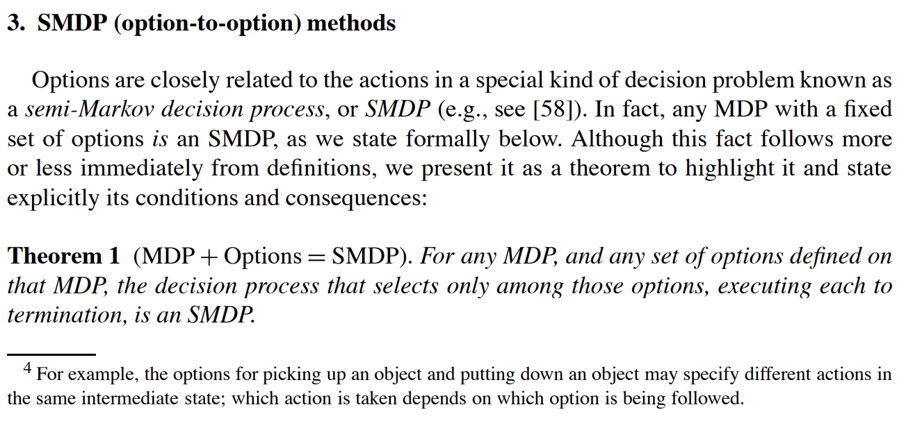

---

title: 经典强化学习算法：分层强化学习算法 —— options算法

description: 

#多个标签请使用英文逗号分隔或使用数组语法

tags: 杂谈

#多个分类请使用英文逗号分隔或使用数组语法，暂不支持多级分类

---

 
 

论文地址：

https://people.cs.umass.edu/~barto/courses/cs687/Sutton-Precup-Singh-AIJ99.pdf

 
 

分层强化学习算法options的原论文中的定义：

 

 

 

 

 
 

 

 

