---

title: 经典强化学习算法：分层强化学习算法 —— options算法(理解篇)

description: 

#多个标签请使用英文逗号分隔或使用数组语法

tags: 杂谈

#多个分类请使用英文逗号分隔或使用数组语法，暂不支持多级分类

---

 
 

论文地址：

https://people.cs.umass.edu/~barto/courses/cs687/Sutton-Precup-Singh-AIJ99.pdf

 
 

例子：

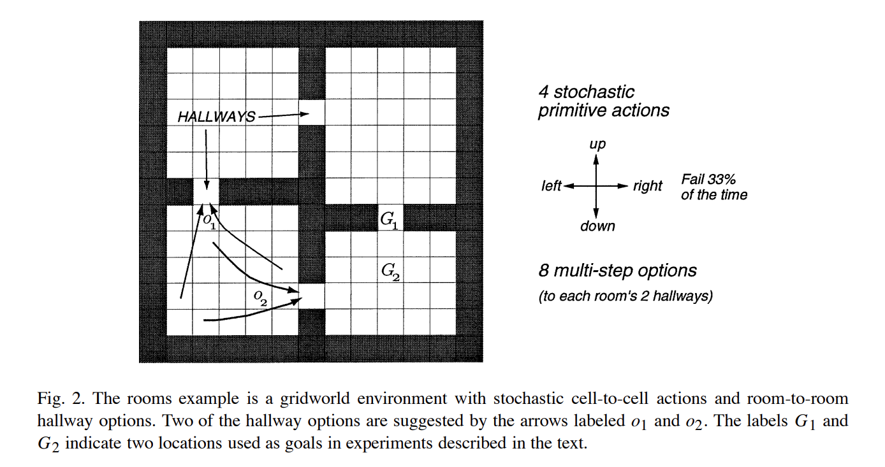

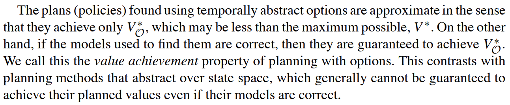

这是一个寻路问题，该问题使用强化学习算法解决，准确的来说是使用“表格表示的强化学习算法中的规划算法”来进行解决的；之所以没有说是使用规划算法来说是因为这里使用了学习型算法，即强化学习算法，虽然只是使用表格记录的方式，但是依旧使用了强化学习算法的形式进行；该问题的解决中对每个方格的状态值表示为V(s)，整体使用策略迭代或值迭代的强化学习的规划算法来解决。

 

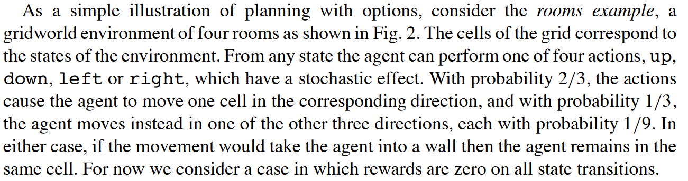

在这个问题中，agent有四个方向可以选择走，但是每次走只有2/3的概率会正确执行，1/3的概率会随机走其他三个方向中的一个；需要注意的是，agent的每一步行走的reward都是零，也就是说这个问题建模后形成的强化学习模型是一个稀疏模型。

 

options算法的核心内容：

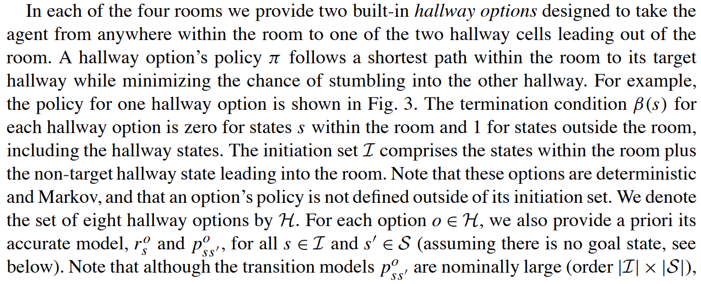

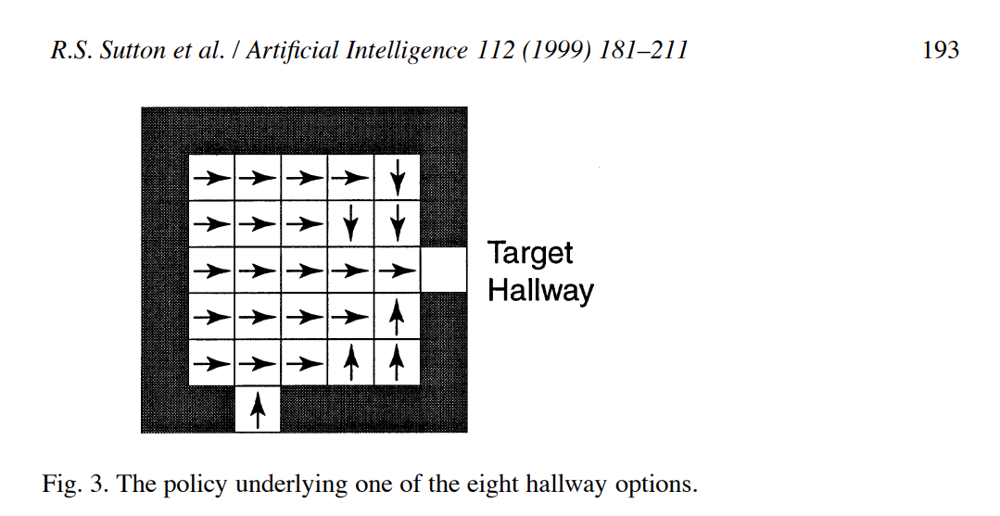

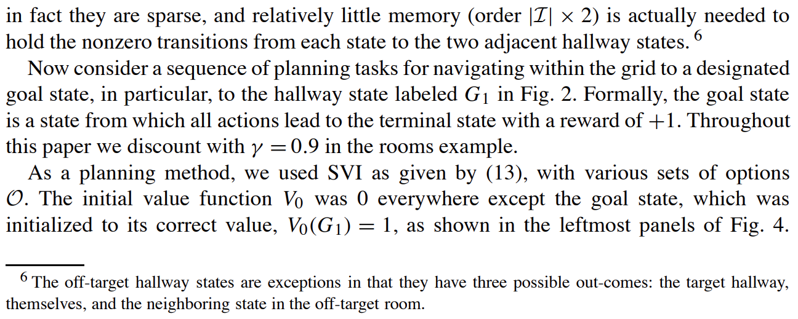

 

options算法在计算过程中的各个位置在表格中的状态值的变化过程示意图：（该问题就是计算所有房间的位置到到达初始位置的状态值V(state)的值大小）

其中下图方块中涂黑的面积大小表示对应的状态值V(s)的值的大小，最大时为1，完全空白为0。

下图中上一行中options的动作为单步，下一行中的options的动作为multi-steps。

multi-steps的options动作指的就是在一次状态值更新时是对划分后问题的一整个option动作覆盖的空间进行计算，下图中则是对整个房间（room）进行更新计算。

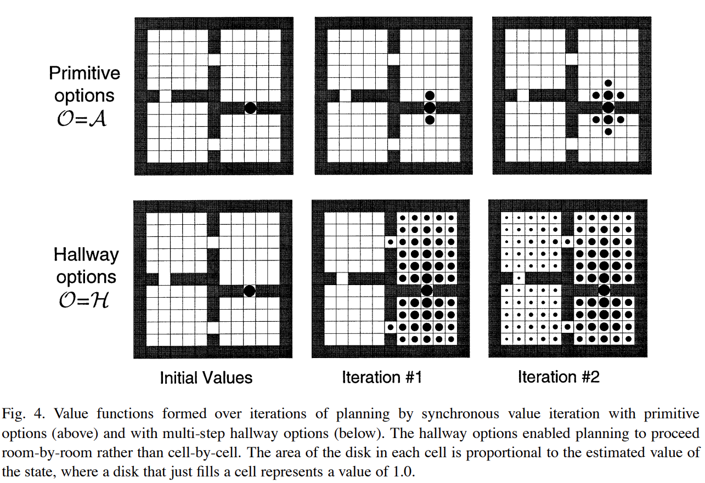

 

 

可以看到，上面的每个room有两个通道（两个空白格），这两个空白格（通道）可以分别作为一个option的target，除了target之外的其他空格都为可行区域（可以作为option的起始点），也就是所对原始任务进行划分后的每个room任务都是可以有两个option的，每个option的终点分布对应room边缘的target hallway。

给出一个room的其中一个option的状态值的示意图（该option的target为右侧边缘的空格，另一个option的target为下侧边缘的空格）：

 

 

 

 

options算法的学习规则：（参数更新的具体方式）

给出一个状态的option示意图：

假设下图中红色状态为s，绿色状态为  $s^,$。

红色状态在下图中的option的Q值记作Q(s, o)，绿色状态的Q值记作Q($s^,$, $o^,$)。

红色状态关于绿色状态的一次采样后的Q值更新具体为：

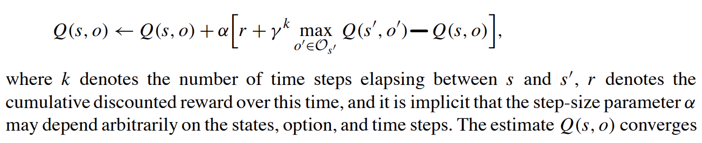

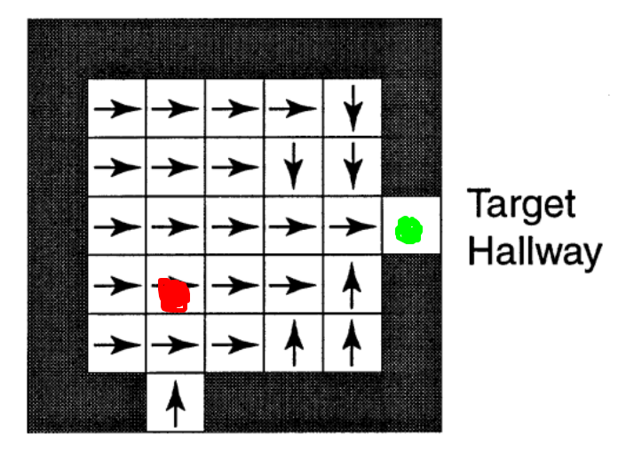

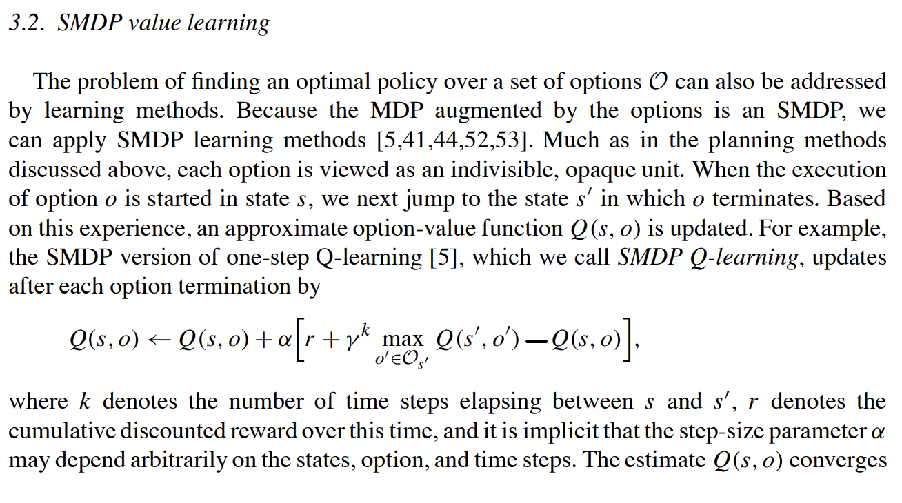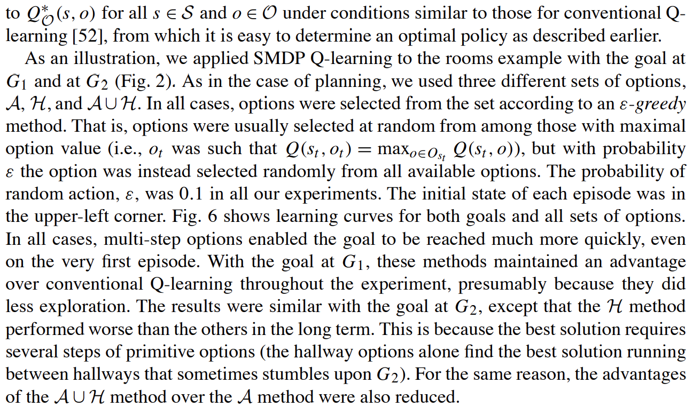

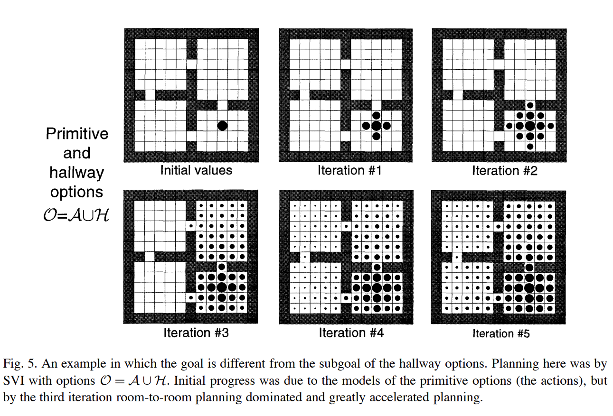

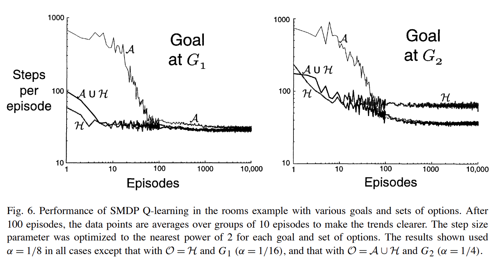

 
 

使用options方法来进行动态规划计算的一些不足：

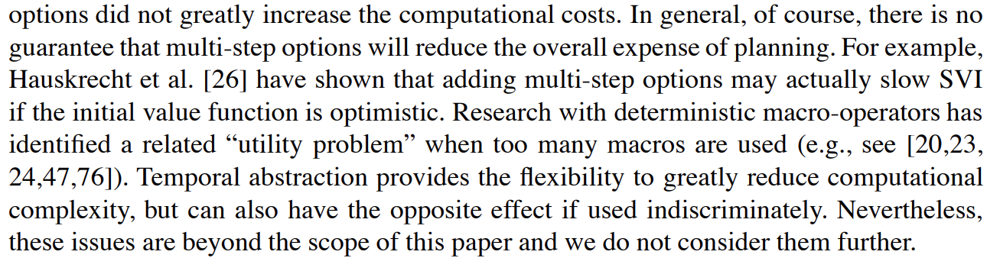

其中，最为注意的就是在使用options进行动态规划的话并不一定能保证加快计算（加快收敛）；一般情况下动态规划时初始所有状态的状态V值为0，但是如果使用乐观的初始化方式（optimistic）那么就是在初始化时将所有的状态V值都初始化为一个较大的数值，比如为100，那么使用options这种multi-steps分层的方法反而会减慢值迭代的动态规划算法的收敛速度。

  

PS：

个人感觉，这个分层强化学习算法中的经典options算法其实和分层 $A^*$ 算法很像，其基本思想是一致的，如果有读者不是很难理解这个options算法可以先去读“分层  $A^*$ 算法”。

本文的options算法本质上是“表格型强化学习算法”。

分层强化学习算法options其本质就是对问题进行分层划分。

本文算法的解决方法是使用表格记录每个位置的状态值V(s)。

 
 

由于options发表的较早，20多年前发表的，因此这篇文章大篇幅谈的是动态规划算法，即如何使用options方法来提升动态规划算法的性能，然后才谈了options算法在learning算法上的一些应用。

 
 

 