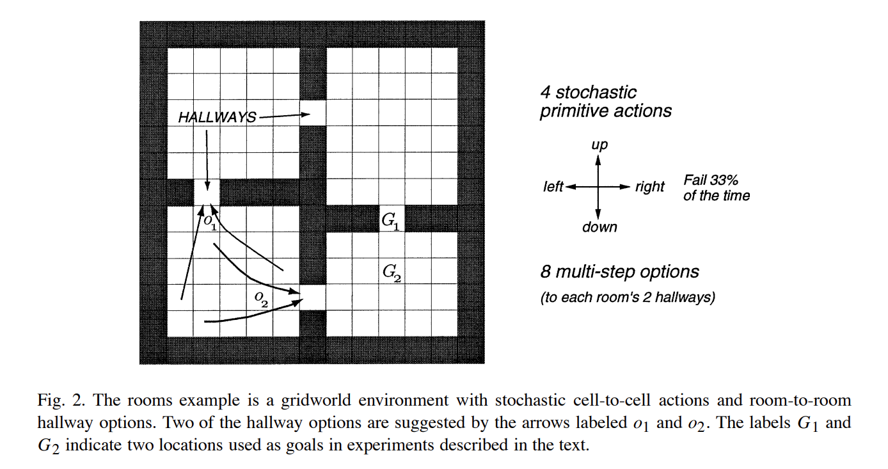
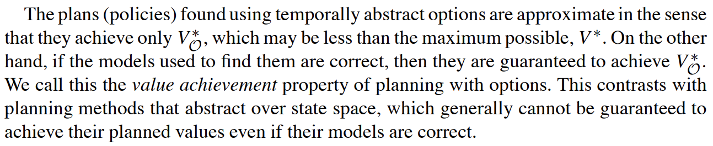
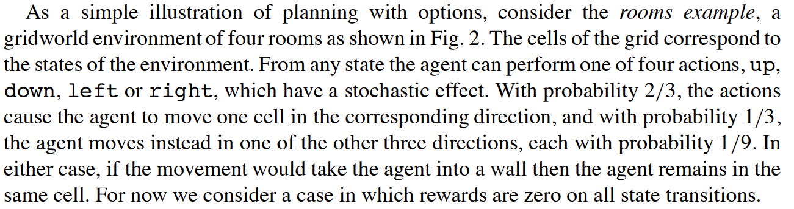

---

title: 经典强化学习算法：分层强化学习算法 —— options算法(理解篇)

description: 

#多个标签请使用英文逗号分隔或使用数组语法

tags: 杂谈

#多个分类请使用英文逗号分隔或使用数组语法，暂不支持多级分类

---

 
 

论文地址：

https://people.cs.umass.edu/~barto/courses/cs687/Sutton-Precup-Singh-AIJ99.pdf

 
 

例子：

这是一个寻路问题，该问题使用强化学习算法解决，准确的来说是使用“表格表示的强化学习算法中的规划算法”来进行解决的；之所以没有说是使用规划算法来说是因为这里使用了学习型算法，即强化学习算法，虽然只是使用表格记录的方式，但是依旧使用了强化学习算法的形式进行；该问题的解决中对每个方格的状态值表示为V(s)，整体使用策略迭代或值迭代的强化学习的规划算法来解决。

 

在这个问题中，agent有四个方向可以选择走，但是每次走只有2/3的概率会正确执行，1/3的概率会随机走其他三个方向中的一个；需要注意的是，agent的每一步行走的reward都是零，也就是说这个问题建模后形成的强化学习模型是一个稀疏模型。

 

 

 
 

PS：

个人感觉，这个分层强化学习算法中的经典options算法其实和分层 \$A^\*\$ 算法很像，其基本思想是一致的，如果有读者不是很难理解这个options算法可以先去读“分层  \$A^\*\$ 算法”。

