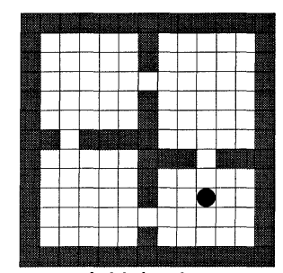
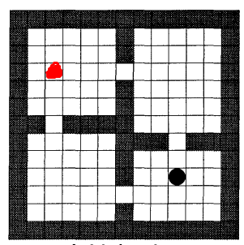

---

title: 使用表格型强化学习算法解决寻路问题的两种建模方式

description: 

#多个标签请使用英文逗号分隔或使用数组语法

tags: 杂谈

#多个分类请使用英文逗号分隔或使用数组语法，暂不支持多级分类

---

 
 

寻路问题示意图：（只有目标点形式的示意图）

 

寻路问题示意图：（带有目标点和起始点形式的示意图，红色位置为起始点，黑色位置为目标点）

 
 

解决强化问题首先需要建模，只有把目标问题建立为强化学习模型后才能使用强化学习算法进行解决；在这一过程中我们在建立强化学习模型（指定环境，状态迁移函数，折扣系数）的同时还需要指定奖励模式，这里根据奖励函数建立的两种不同方法给出两种建模方式。

第一种，最为常见的方式，即每走一步则设置回报奖励值为 -1，算法的优化目标就是如何获得最大奖励的方式获得到目标点；这种方式我们可以从起始点开始进行强化学习计算，也可以从目标点开始进行强化学习计算，但是通常习惯来说都是从起始点开始进行计算的，也就是从起始点开始进行状态值V(state)的值更新的。

重点：

从起始点开始计算，每一步奖励值为 -1，到达目标点时奖励值为100。

 

第二种，设置每走一步的回报奖励值为0，到达目标点后的回报值为1或者100等较大的奖励值；该种建模方法则应该从目标点开始进行计算，即从目标点开始进行状态值V(state)的值更新。

重点：

每一步奖励值为0，从目标点开始反向计算，由于到达目标点时的奖励为100，因此整个计算过程中目标点的V(target_state)=100是保持固定不变的。

 

 

分析：

第二种计算方法（建模方法）可以应对多种起始点的情况，因为是从目标点开始计算的，因此最后会获得所有状态的V值，这样不论起始点在在那一个位置都可以直接获得。

 

 

PS:

第二种建模的方法十分的少见，是本人在阅读分层强化学习算法options论文的时候发现其中大量采用第二种方式进行建模，于是便有了本篇blog。

 

 