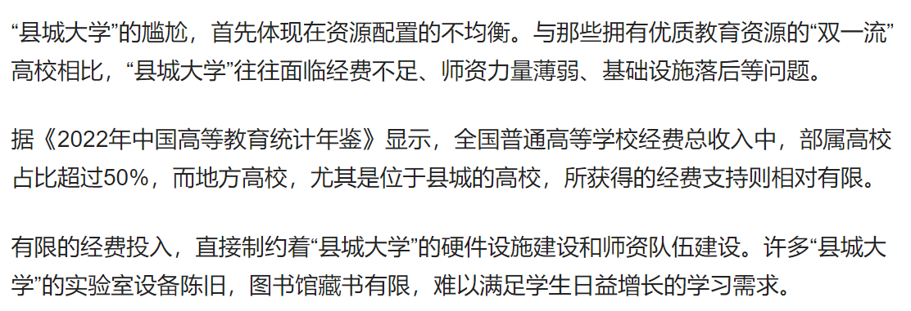

---

title: 县城大学的出路在哪？

description: 

#多个标签请使用英文逗号分隔或使用数组语法

tags: 杂谈

#多个分类请使用英文逗号分隔或使用数组语法，暂不支持多级分类

---

 
 

相关：

[县城大学，一种尴尬的存在，对此你们怎么看？](https://mbd.baidu.com/newspage/data/landingsuper?context=%7B%22nid%22%3A%22news_9471254218794033502%22%7D&amp;n_type=-1&amp;p_from=-1)

 
 

据《2022年中国高等教育统计年鉴》显示，全国普通高等学校经费总收入中，部属高校占比超过50%，而地方高校，尤其是位于县城的高校，所获得的经费支持则相对有限。

 

 

中国的教育资源不平衡不仅仅是体现在中小学甚至是高中的教育阶段，在我看来中国的教育资源的分布不均衡的问题是全方面的，因为即使是高等教育阶段依旧有着较大的分布差别。

由于很多“县城大学”的条件有限，导致既招不来好老师也招不来好的学苗，再加上没有足够的资金支持，于是这种的大学就成了真正意义的“水货大学”；这样的大学往往在社会上的价值并不是教书育人而是一个大型的幼儿园，或是面向大龄的保姆学校；而这样的“水货大学”往往也不会指望有什么教学，当然也不会指望学生上课学习什么的，只要学生上课不捣乱那就谢天谢地了。

有人说中国现在的大学教育水平差，但是我想这里面很大一部分的贡献就是这些“水货大学”提供的。如何改进这些“水货大学”是几十年的难题，而且目前来看短时间内也不可能解决，而这些“水货大学”的真正意义其实也不在于培养人才，其更多的意义是稳定社会。

“水货大学”的出现看似是教育资源分配的不平衡，其实更多的是各地区的区域发展不平衡所导致的。除了全国34所985大学是直接拿中央财政支持的，其他的高校都是依靠地方财政支持的，而这些“县级大学“正是当地经济落后的受害者，如果没有足够的经济支持那么一切都是空谈。

 
 