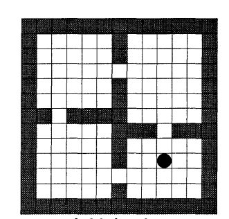

---

title: 解惑篇：为什么教材中总说不能一步一更新的强化学习算法效率低呢？

description: 

#多个标签请使用英文逗号分隔或使用数组语法

tags: 杂谈

#多个分类请使用英文逗号分隔或使用数组语法，暂不支持多级分类

---

 
 

在AI科目的教材中关于强化学习的状态值V(state)或状态动作值Q(state, action)更新时往往有这么一句话的描述，那就是某某算法不能一步一更新因此算法效率低，那么为什么不能一步一更新的强化学习算法效率低？

首先要说明的是教材中说的那种不能一步一更新的强化学习算法主要是指蒙特卡洛这种需要收集一整个episode数据之后才能进行更新的算法，至于近几年常用的multi-steps算法是不被包括在里面的，而且根据近几年的基于深度神经网络的强化学习算法的表现来看使用episode方式或multi-steps方式对强化学习算法进行更新的方式往往比one-step方式算法收敛的更快，算法效率更高；因为episode方式或multi-steps方式往往会较少误差，但是同时也会提高计算方差，因此适当的采用episode方式或multi-steps方式会提升算法性能，而不是一味的说这样就一定会提升算法性能，这是要看具体情况的，需要在实际运行中进行调试来查看的。

 

之所以说现有的“强化学习教材”中都会说不能一步一更新的强化学习算法效率低呢？

其实，知道前面的表述我们就知道这其实是一个历史原因，是一个老旧的说法，当年的这个说法是源自于上世纪80年代和90年代时候的，那个时候强化学习领域的主要算法形式并不是今天常见的神经网络做函数近似，甚至连基础的线性函数近似表述都很少采用，那个时候的强化学习算法主要是表格形式的问题，基本常见的问题都是寻路这样的问题，如：

这样的问题主要都是使用动态规划（planning方法：值迭代、策略迭代）的方式来进行计算的，即使是使用learning方法往往也是使用表格表示的Q-learning方法，因此在这样的问题里面就有了本文题目中所提的问题，那就是一步一更新的方式效率最高。

动态规划的算法就不用多表述了，不论是值迭代、策略迭代都是对状态进行遍历，一个状态一更新那是基本的操作要求；而在learning方法中，如表格表示的Q-learning算法，使用一步一更新的方法要远远比episode方式或multi-steps方式效率高很多，而这就是教材中所说的这句话的原因。

 

总结来说：

这个说法，或者说这个问题，其根本原因就是教材来源太过老旧，之前的教材就是这个说法，然后后面的人根据之前人所写的那个教材重新改写然后就重新接着使用这样的描述话语了，然后教材编撰者也一个接一个的把这个说法延续下来了，但是现在的教材往往不会交代当初最早写这句话的作者所指的是一个怎么样的背景和环境，慢慢的到了现在这个深度学习和神经网络盛行的时代这句话就变得十分诡异下来了，你如果说这句话说的对那么你又实在想不出道理，但是你如果说这话不对那么为什么数十年来这句话一直被流传下来呢，而本文就是对此的解惑。

 
 

 
 

