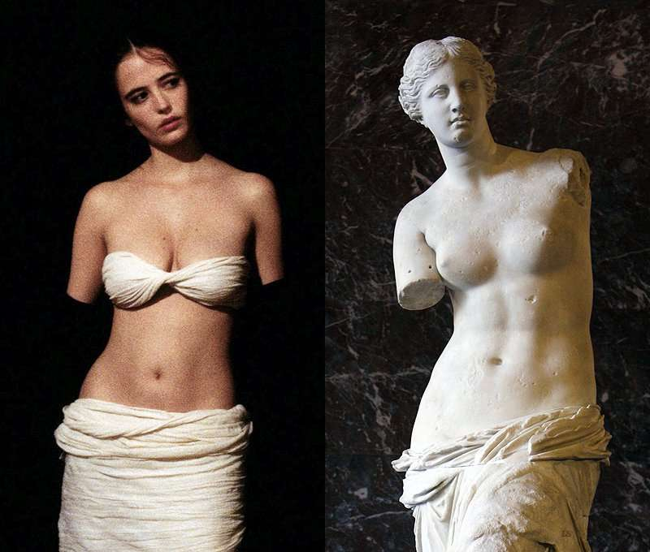
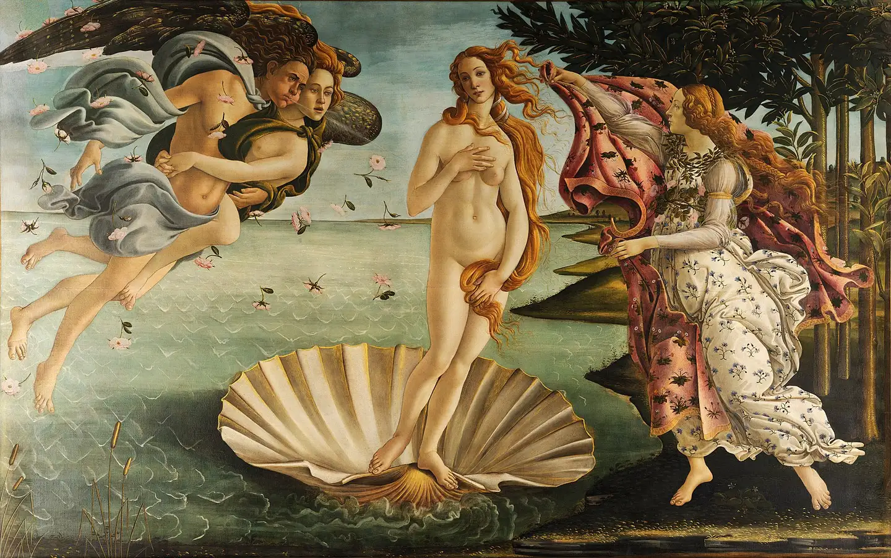
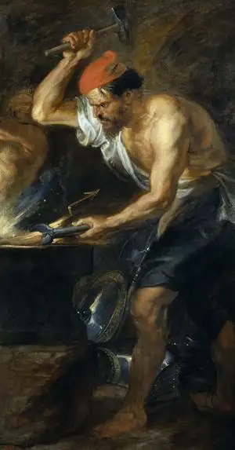
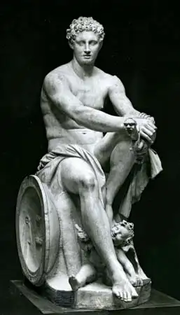
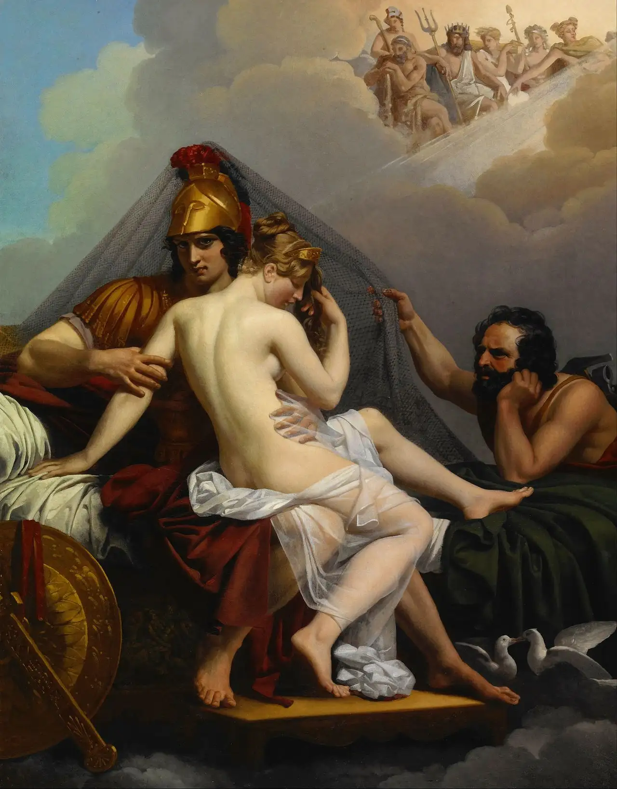
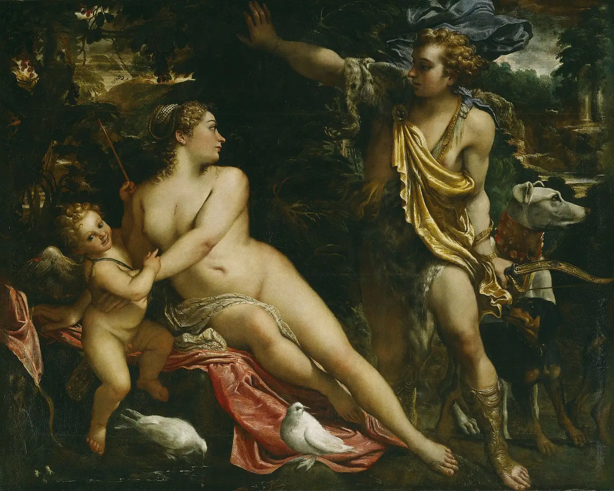
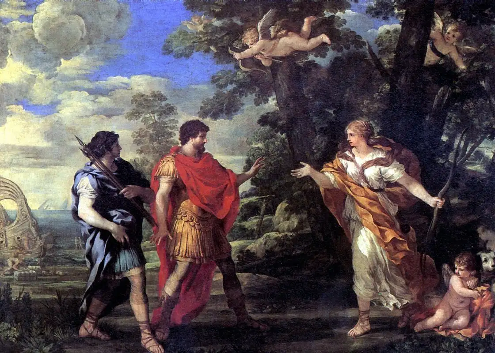

\---

title: 北欧神话—希腊神话—罗马神话中的爱神维纳斯

description: 

\#多个标签请使用英文逗号分隔或使用数组语法

tags: 杂谈

\#多个分类请使用英文逗号分隔或使用数组语法，暂不支持多级分类

\---

相关：

https://zhuanlan.zhihu.com/p/54688490

 

爱神维纳斯是北欧、古希腊、罗马神话中的人物，

 

《戏梦巴黎》中的伊娃格林真美：

 

维纳斯的诞生：

 

克洛诺斯阉割乌拉诺斯:

 

工匠之神赫淮斯托斯:

 

战神玛尔斯:

 

捉奸在床的玛尔斯与维纳斯:

 

小爱神丘比特（希腊名厄罗斯）:

 

维纳斯与美少年阿多尼斯:

 

电影《特洛伊》中的帕里斯与海伦:

 

维纳斯与埃涅阿斯:

 

 