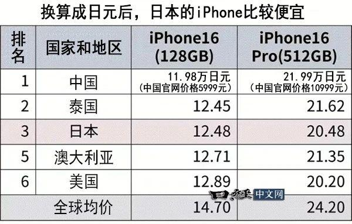

---

title: 感谢华为：iPhone 16全球价格对比：中国最便宜！比均价低1200元

description: 

#多个标签请使用英文逗号分隔或使用数组语法

tags: 杂谈

#多个分类请使用英文逗号分隔或使用数组语法，暂不支持多级分类

---

 

相关：

**https://baijiahao.baidu.com/s?id=1811582397991377070&wfr=spider&for=pc**

 

苹果最新的iPhone 16系列已正式发售，不过由于种种原因在全球各地的定价也不尽相同，日本MM综研对iPhone16在全球39个国家和地区的价格进行了对比。

结果显示，从128GB的iPhone 16来看，中国的苹果手机价格为全球最低。

调查比较了iPhone 16系列的四款机型在各地的苹果在线商店价格，由于是日本的机构，因此最终换算成日元进行比较。

 

